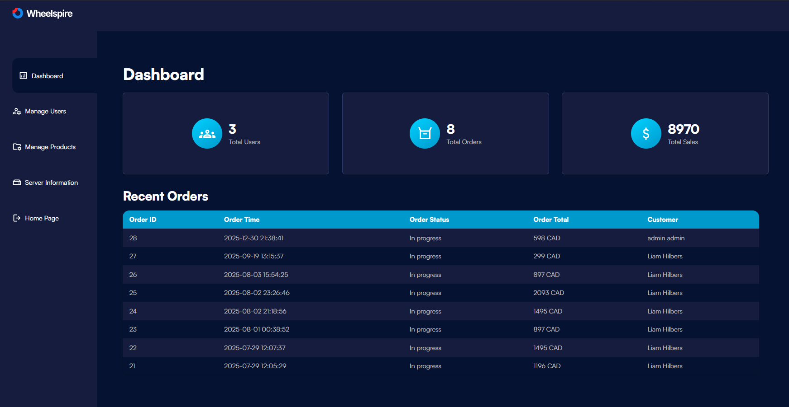
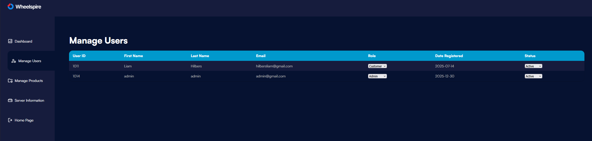
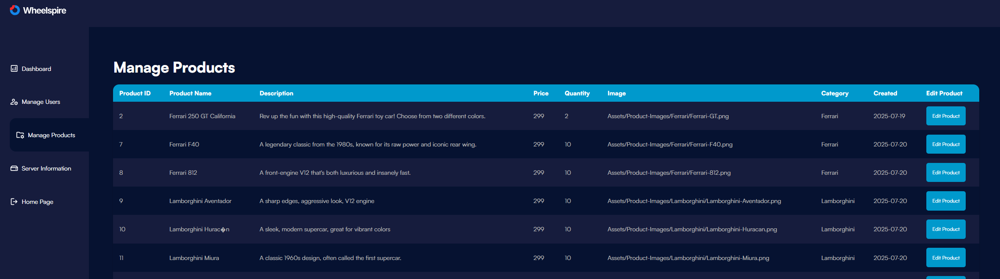

# Wheelspire - Full Stack Website

https://wheelspire.liamhilbers.dev/

Wheelspire is an full stack e-commerce website for premium model cars. It allows users to browse products, place orders, and manage their accounts, while admins can view orders, manage products, and track sales.

## Features

- User registration and login
- User profiles can be edited by the user
- Product catalog categorized as different brands
- Shopping cart and checkout system
- Admin dashboard with order and user management
- Real-time sales and user statistics

## Languages & Technologies Used

- **PHP** (Backend)
- **MySQL** (Database)
- **HTML5 / CSS3** (Frontend structure and design)
- **JavaScript** (Interactivity and dynamic content)
- **NGINX** (Hosting)

## Admin Dashboard (Private)

The admin dashboard is protected and not accessible to public users.
Screenshots below demonstrate the admin functionality.

### Dashboard Overview

### User Management

### Product Management

